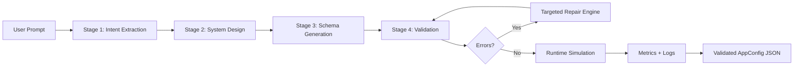
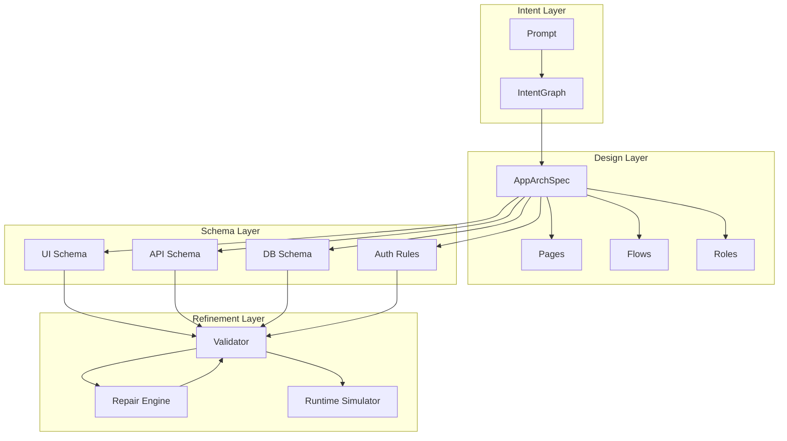
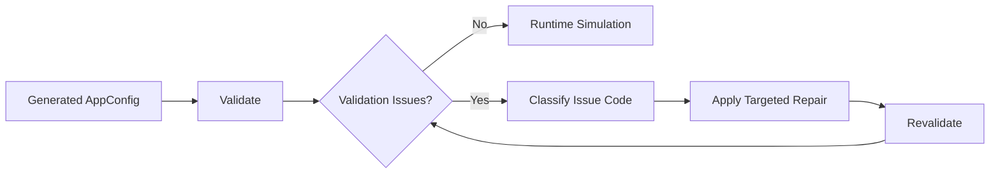
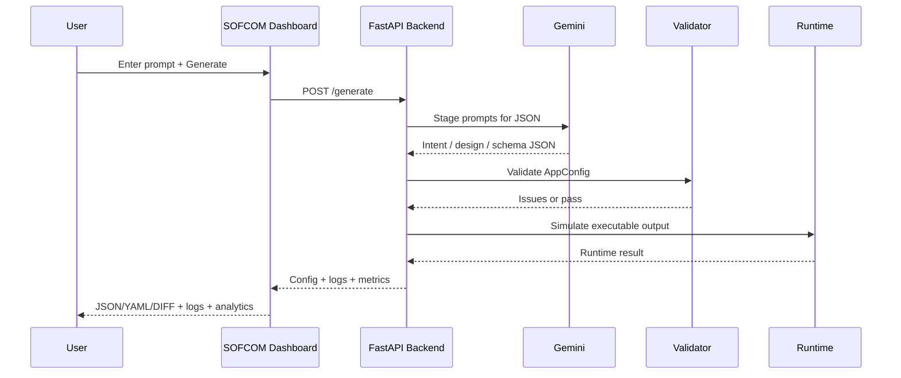

# SOFCOM

SOFCOM is an autonomous AI app compiler that converts natural-language product prompts into a validated, executable app configuration.

The system is intentionally multi-stage: it does not rely on one giant prompt. A user prompt is converted into intent, architecture, schemas, validation results, repair actions, runtime simulation, and metrics. The frontend presents this as a live compiler dashboard with logs, pipeline stages, JSON/YAML/DIFF output, runtime analytics, and evaluation metrics.

## Current Capabilities

- Prompt-to-JSON app compilation through Gemini
- Strict typed output contract with Pydantic models
- Multi-stage generation pipeline
- Cross-layer validation across UI, API, DB, auth, and business logic
- Targeted repair passes for schema inconsistencies
- Runtime simulation that proves generated output is executable
- Live compiler logs with validation issues and repair actions
- Evaluation dataset with 10 product prompts and 10 edge-case prompts
- Session metrics for user-entered prompts
- React/Vite/Tailwind dashboard with Monaco config viewer
- Vercel-ready frontend/backend deployment

## Tech Stack

Frontend:
- React 18
- Vite
- TypeScript
- Tailwind CSS
- Framer Motion
- Zustand
- TanStack Query
- Monaco Editor
- Recharts
- Lucide Icons

Backend:
- FastAPI
- Pydantic
- Gemini API
- httpx
- runtime artifact simulation
- targeted validation and repair engine

## End-to-End Workflow



## Pipeline Design

SOFCOM separates generation into stages so each stage has a clear contract and can be validated independently.

### Stage 1: Intent Extraction

File: `backend/pipeline/stage1_intent.py`

Input: raw user prompt  
Output: `IntentGraph`

Responsibilities:
- read the prompt using Gemini
- extract product type, features, entities, roles, assumptions, and ambiguity score
- preserve prompt-specific resources instead of forcing every app into a canned template
- detect underspecified or placeholder prompts

### Stage 2: System Design

File: `backend/pipeline/stage2_design.py`

Input: `IntentGraph`  
Output: `AppArchSpec`

Responsibilities:
- convert intent into app architecture
- define pages, flows, roles, and user journeys
- keep design connected to the extracted prompt intent

### Stage 3: Schema Generation

File: `backend/pipeline/stage3_schema.py`

Input: `AppArchSpec`  
Output:
- UI schema
- API schema
- DB schema
- Auth rules

Responsibilities:
- generate layer-specific schemas
- map UI components to APIs
- map API fields to database tables
- keep auth rules aligned with role access

### Stage 4: Validation, Repair, Runtime

File: `backend/pipeline/stage4_refinement.py`

Input: assembled `AppConfig`  
Output: validated `AppConfig`, logs, runtime result, metrics

Responsibilities:
- run cross-layer validation
- repair specific inconsistencies
- revalidate after each repair
- simulate execution
- record latency, repair passes, issue count, and success state

## Stage Connection Diagram



## Validation + Repair System

Validator: `backend/repair/validators.py`  
Repair engine: `backend/repair/engine.py`

The validator checks:
- UI pages exist
- API endpoints exist
- DB tables exist
- API response entities exist in DB schema
- API request fields exist in DB columns
- UI component endpoints exist in API schema
- UI fields map to DB fields
- roles are consistent across UI, API, and auth rules
- prompt-mentioned resources are represented in the generated schema

The repair engine is issue-code driven. It does not blindly retry the whole generation. For example:
- missing DB table -> add the table
- missing API endpoint -> add endpoint for that UI component
- missing field -> add field to the relevant table
- unknown role -> add matching auth rule
- prompt-mentioned resource missing -> add resource to architecture, DB, API, and UI



## Reliability Strategy

SOFCOM uses several reliability layers:

- strict Pydantic contracts for all output models
- Gemini JSON mode via `responseMimeType: application/json`
- model discovery before generation so the backend can choose a usable Gemini model
- strict LLM mode for production submissions
- no silent deterministic fallback when Gemini is configured
- validation before runtime simulation
- bounded repair loop
- runtime executable check
- logs for every stage, issue, and repair action

In production, the recommended settings are:

```env
LLM_PROVIDER=gemini
GEMINI_API_KEY=YOUR_KEY
GEMINI_API_VERSION=v1beta
GEMINI_MODEL=gemini-2.0-flash
GEMINI_MODEL_FALLBACKS=gemini-2.5-flash,gemini-2.0-flash,gemini-1.5-flash-latest,gemini-1.5-flash
STRICT_LLM=true
ALLOW_DETERMINISTIC_FALLBACK=false
BYPASS_COMPILE_CACHE=true
```

With this setup, SOFCOM either returns Gemini-generated JSON or surfaces the real Gemini error. It does not silently return fake/prewritten fallback JSON.

## Quality vs Latency vs Cost

SOFCOM balances quality, latency, and cost through staged generation:

- Quality: Gemini is used for prompt understanding and schema generation, then Pydantic validation and repair enforce structure.
- Latency: stages run schema generation in parallel where possible, and the frontend streams stage logs and metrics.
- Cost: evaluation and compilation are separated. `/generate` compiles one prompt; `/evaluate` runs the 20-prompt benchmark only when requested.
- Reliability: strict mode prevents misleading fallback output, even if that means surfacing an error instead of pretending generation succeeded.

## Evaluation Framework

Dataset: `backend/evaluation/dataset.py`  
Runner: `backend/evaluation/runner.py`

The dataset contains:
- 10 realistic product prompts
- 10 edge cases, including vague, conflicting, and incomplete requirements

Tracked metrics:
- success rate
- retries / repair passes per request
- validation failures
- runtime failures
- average latency

The frontend evaluation bar shows:
- backend dataset metrics from `/evaluate`
- testing prompts tab with all 20 prompts
- session metrics for user prompts beyond the dataset

## Runtime Awareness

Runtime simulator: `backend/runtime/simulator.py`

The simulator:
- verifies unresolved validation errors are not present
- checks generated routes
- writes an artifact to `generated_apps/<app_id>/index.html`
- marks the config executable or failed



## API Endpoints

- `GET /health`
- `POST /generate`
- `POST /validate`
- `POST /simulate`
- `POST /evaluate`
- `GET /apps/<app_id>/index.html`

## Repository Structure

```text
api/
  main.py
backend/
  cache/cache.py
  evaluation/
    dataset.py
    runner.py
  llm/client.py
  pipeline/
    stage1_intent.py
    stage2_design.py
    stage3_schema.py
    stage4_refinement.py
  repair/
    validators.py
    engine.py
  runtime/simulator.py
  schemas/final_config.py
frontend/
  src/features/dashboard/
generated_apps/
```

## Local Run

Backend:

```bash
pip install -r requirements.txt
uvicorn api.main:app --reload --port 8000
```

Frontend:

```bash
cd frontend
npm install
npm run dev -- --host 127.0.0.1 --port 4173
```

Open:
- frontend: `http://127.0.0.1:4173`
- backend health: `http://127.0.0.1:8000/health`

## Deployment Notes

SOFCOM is deployed as two Vercel projects:

- backend: FastAPI app from the repository root
- frontend: Vite app from `frontend/`

Frontend calls backend through the Vercel rewrite in `frontend/vercel.json`, so production API calls go through `/backend/*`.
